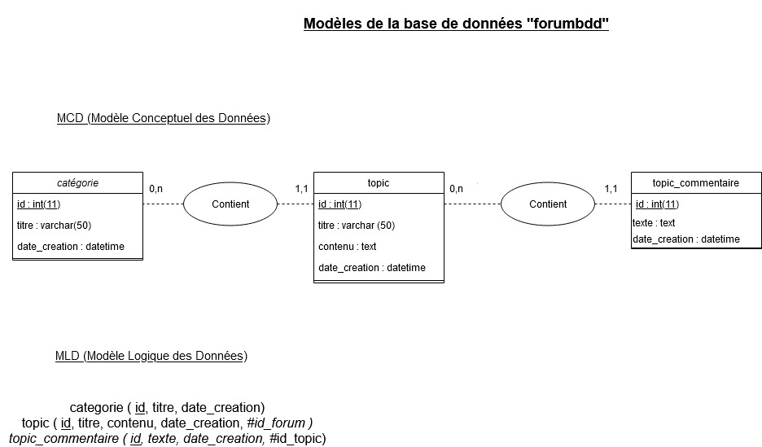

# Test technique pour l'entreprise Huggii

## J'ai créé ce forum en PHP pour un test technique pour l'entreprise HUGGII.

> Ce forum permet de lister des topics en fonction de leur catégorie, puis ensuite rencense les messages du topic.
>
> Le forum ne comporte pas de session utilisateur.
>
> L'utilisateur a la possibilité de créer un topic en l'attachant à une catégorie, et écrire des messages sur les topics existants.
>
> Ce répertoire contient le fichier mysql de la base de données du forum présent dans le dossier bdd. 

# Modèle Conceptuel de Données ( MCD ) et Modèle Logique de Données ( MLD )

